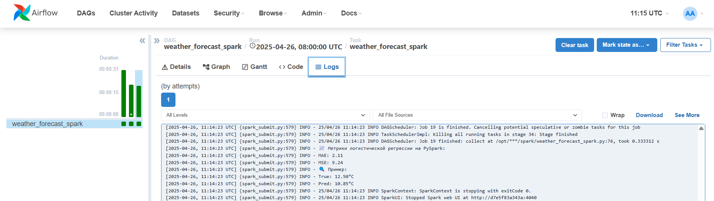
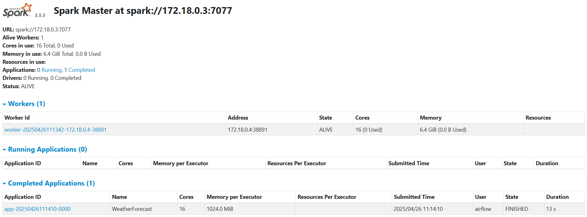
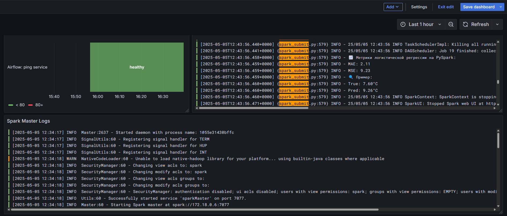

# Lab 1

Сделан базовый сетап проекта: поднят docker с airflow, написан первый базовый dag - предсказание погоды.

# Lab 2

В docker-compose добавлен spark + появился dag с обработкой данных и обучением простой модели c использованием pyspark.

# Lab 3

Создан CI/CD пайплайн на GitHub Actions для автоматического тестирования, сборки и деплоя приложения. Тестируются наличие директорий `dags/` и `spark/`. Сборка пропускается для веток с префиксом `feature/`, деплой выполняется только для веток `main`, `master`, `develop` и при пуше тегов `v*`.

# Lab 4

К Airflow и Spark был подключен мониторинг + логирование. Для визуализации был создан простой дашборд с использованием датасурсов Zabbix и Loki.

